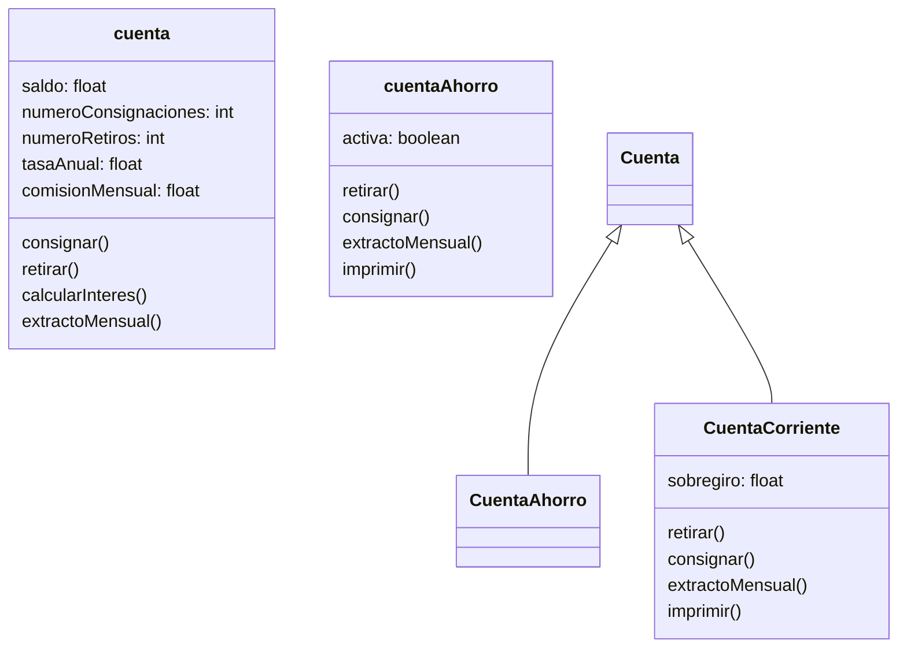

## Diagrama de clases

Este diagrama representa la estructura de las clases utilizadas en el sistema y la relación de herencia entre ellas.

```mermaid
classDiagram

class cuenta{
  saldo: float
  numeroConsignaciones: int
  numeroRetiros: int
  tasaAnual: float
  comisionMensual: float
  consignar()
  retirar()
  calcularInteres()
  extractoMensual()
}

class cuentaAhorro{
  activa: boolean
  retirar()
  consignar()
  extractoMensual()
  imprimir()
}

class CuentaCorriente{
  sobregiro: float
  retirar()
  consignar()
  extractoMensual()
  imprimir()
}

Cuenta <|-- CuentaAhorro
Cuenta <|-- CuentaCorriente
```